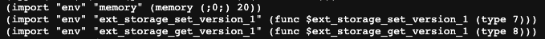

# Java Host Research
This repo contains research documents and PoC application showcasing the feasibility of using wasmer-java as a Host Wasm Runtime Environment. The research was conducted in accordance to the W3F foundation [grant](https://github.com/w3f/Grants-Program/pull/1353).

## Research Documents
3 main documents were produced as result of the research:
- [Research Outcome](https://github.com/LimeChain/java-host-research/blob/main/research/java-host-research-outcome.md)
- [Java Light Client Design](https://github.com/LimeChain/java-host-research/blob/main/research/java-host-light-client-high-level-design.md)
- [Polkadot Java Host Design](https://github.com/LimeChain/java-host-research/blob/main/research/java-polkadot-host-high-level-design.md)

Additionally 2 more documents were created:
- [Scope & Estimation for Libp2p JVM Kademlia Implementation](https://github.com/LimeChain/java-host-research/blob/main/research/libp2p-kademlia-for-jvm-scope-estimation.md)
- [Scope & Estimation for Libp2p JVM Yamux Implementation](https://github.com/LimeChain/java-host-research/blob/main/research/libp2p-yamux-jvm-scope-estimation.md)

## Proof of Concept Demo
Prerequisites - Docker

You can check if you have docker installed by running `docker -v`

If you don't have docker you can download it from [here](https://docs.docker.com/get-docker/)

PoC consists of a couple of carefully tailored examples which would be called in the docker container
and have their output saved in a text file in the container.

1. create the docker image - `docker build -t wasmer-java wasmer-java`
2. create and enter container - `sudo docker run -it wasmer-java bash`
3. view output file - `less /opt/wasmer-java/output.txt`

The first example being run tests imports by loading a runtime requiring the following imports: 

The second example manipulates memory through a pointer returned by the function invoked

Both of the examples as well as the wasm files can be found [here](https://github.com/LimeChain/wasmer-java/tree/master/examples).
Note that the runtime wasm file also has a wat variant and the hello_world wasm file was compiled from the rust file with the same name.
### Testing guide
